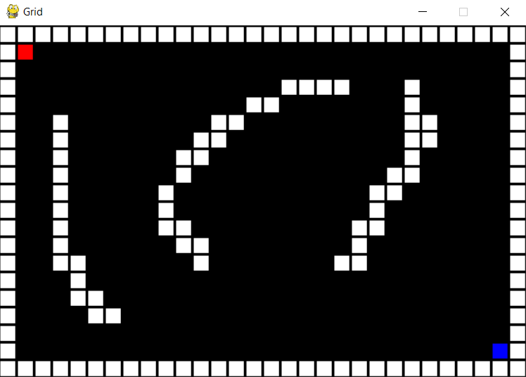
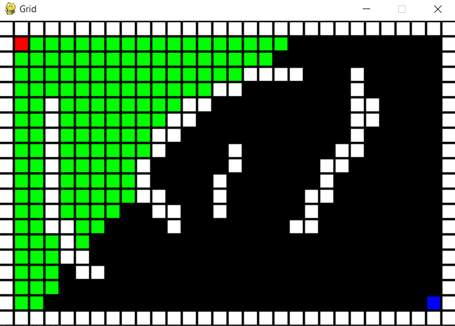
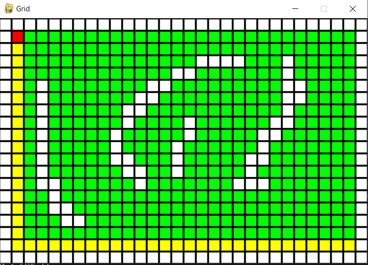

# Readme.md

This repo aims to visualise different path finding algorithms.
the algorithms implemented are:

* BFS
* DFS

the different files are:

1. bfs_terminal.py : BFS used to solve maze in terminal
2. bfs_gui.py : BFS used to solve maze and display in a gui
3. dfs_terminal.py : DFS used to solve maze in terminal
4. dfs_gui.py : DFS used to solve maze and display in a gui
5. path_finding_visual.py : a Gui to create a maze and then use BFS or DFS to solve it.
6. grids: contains mazes used in bfs_terminal and dfs_terminal

Modules used are:

1. Turtle
2. pygame
3. collections

## ToDo

1. Add A* algorithm

## Screenschots

Create a Maze

Searching for Solution

Found the Smallest Path

